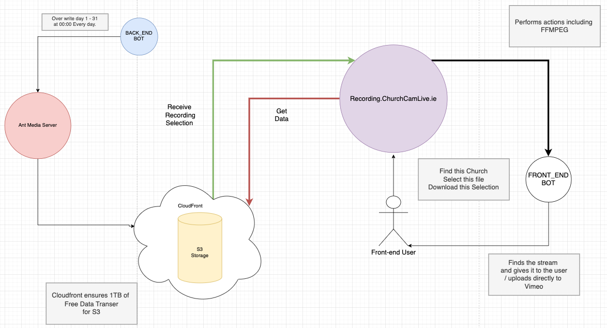

# mp4-url-recorder

Project Owners: Kristian Colville, Declan O'Sullivan

<h2>Link here</h2>

 

## Table of Contents

* [Project Goals](#project-goals)
  * [User Goals](#user-goals)
  * [Site Owners Goals](#site-owners-goals)
* [User Experience](#user-experience)
  * [Target Audience](#target-audience)
  * [User Requirements and Expectations](#user-requirements-and-expectations)
  * [User Stories](#user-stories)
* [Agile Methodology](#agile-methodology)
  * [Epics](#epics)
* [Design](#design)
  * [Color Scheme](#color-scheme)
  * [Typography](#typography)
  * [Structure](#structure)
    * [Wireframes](#wireframes)
* [Business Model](#business-model)
  * [Goals](#goals)
  * [Target Audience](#target-audience)
  * [Strategy](#strategy)
* [Information Architecture](#information-architecture)
  * [Database](#database)
  * [Data Modeling](#data-modeling)
* [Features](#features)
* [Testing](#testing)
* [Bugs](#bugs)
* [Technologies &amp; Tools](#technologies--tools)
* [Development &amp; Deployment](#development--deployment)
  * [Version Control](#version-control)
  * [Cloning this Repository](#cloning-this-repository)
  * [AWS](#aws)
* [Credits](#credits)
* [Acknowledgments](#acknowledgments)

## Project Goals

Build a web application capable of selecting an MP4 recording from an AWS S3. The web application should be capable of using FFMPEG to select a portion of an MP4 file for download. The web application should be user-friendly and have minimalist features to enable a quick and easy user experience. 

The web application could also possibly upload the content directly to Vimeo to reduce the time spent using the web application. 

### User Goals

To use a web application capable of downloading a specific selection of a recording that is needed for business. To have the option to use an application that lessens the need for a tech-savvy user to perform these actions.

The web application should be straightforward to use so that anyone performing this task can easily understand how to operate the web application.

### Site Owners Goals

[Back to Top](#table-of-contents)

## User Experience
### Target Audience
### User Requirements and Expectations
### User Stories

[Back to Top](#table-of-contents)

## Agile Methodology
### Epics

[Back to Top](#table-of-contents)

## Design
### Color Scheme
### Typography
### Structure
#### Wireframes

[Back to Top](#table-of-contents)

## Business Model
### Goals
### Target Audience
### Strategy

[Back to Top](#table-of-contents)

## Information Architecture

### Database
### Data Modeling

[Back to Top](#table-of-contents)

## Features

[Back to Top](#table-of-contents)

## Testing

[Back to Top](#table-of-contents)

## Bugs

[Back to Top](#table-of-contents)

## Technologies & Tools

[Back to Top](#table-of-contents)

## Development & Deployment
### Version Control
### Cloning this Repository
### AWS

[Back to Top](#table-of-contents)

## Credits

[Back to Top](#table-of-contents)

## Acknowledgments