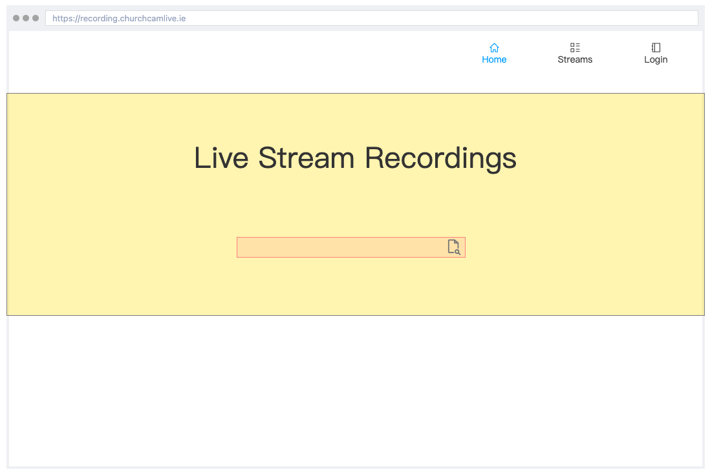
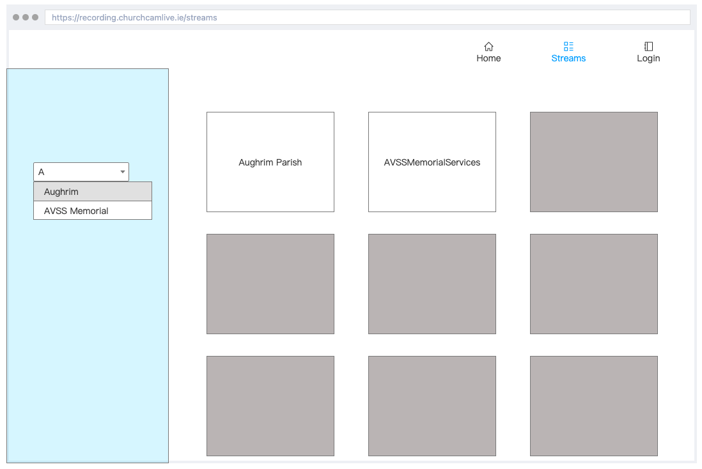

# mp4-url-recorder

Project Owners: Kristian Colville, Declan O'Sullivan

<h2>Link here</h2>

 

## Table of Contents

* [Project Goals](#project-goals)
  * [User Goals](#user-goals)
  * [Site Owners Goals](#site-owners-goals)
* [User Experience](#user-experience)
  * [Target Audience](#target-audience)
  * [User Requirements and Expectations](#user-requirements-and-expectations)
  * [User Stories](#user-stories)
* [Agile Methodology](#agile-methodology)
  * [Epics](#epics)
* [Design](#design)
  * [Color Scheme](#color-scheme)
  * [Typography](#typography)
  * [Structure](#structure)
    * [Wireframes](#wireframes)
* [Business Model](#business-model)
  * [Goals](#goals)
  * [Target Audience](#target-audience)
  * [Strategy](#strategy)
* [Information Architecture](#information-architecture)
  * [Database](#database)
  * [Data Modeling](#data-modeling)
* [Features](#features)
* [Testing](#testing)
* [Bugs](#bugs)
* [Technologies &amp; Tools](#technologies--tools)
* [Development &amp; Deployment](#development--deployment)
  * [Version Control](#version-control)
  * [AWS](#aws)
* [Credits](#credits)
* [Acknowledgments](#acknowledgments)

## Project Goals

Build a web application capable of selecting an MP4 recording from an AWS S3. The web application should be capable of using FFMPEG to select a portion of an MP4 file for download. The web application should be user-friendly and have minimalist features to enable a quick and easy user experience. 

The web application could also possibly upload the content directly to Vimeo to reduce the time spent using the web application. 

### User Goals

To use a web application capable of downloading a specific selection of a recording that is needed for business. To have the option to use an application that lessens the need for a tech-savvy user to perform these actions.

The web application should be straightforward to use so that anyone performing this task can easily understand how to operate the web application.

### Site Owners Goals

- Create a website that manages all of the complicated processes that are involved in getting a recording.
- Simplify the experience and speed up the time to acquire a recording.
- Build a powerful web application capable of performing CRUD functionality along with advanced programming capabilities.
- Using FFMPEG select a portion of a file from a request header and use that to chop a selection so it can be given to a customer when requested.
- Take the burden of storage for camera recordings to increase potential availability and revenue.
Increase the reliability of the service.
- Run the web application smoothly so advertising can commence on the product.

[Back to Top](#table-of-contents)

## User Experience
### Target Audience

Any staff member tasked with collecting a recording and giving the result to the customer.

### User Requirements and Expectations

- Simplicity throughout the website for clear navigation to complete a recording.
- Information is structured in an organized and easy-to-follow manner.
- The CRUD functionality works as expected with feedback provided for each appropriate response.
- The simplicity is perfectly implemented with no unnecessary complexity diminishing the user experience.
- All personal information is securely stored and protected.

### User Stories

| Issue ID | User Story |
|---|---|
|||
|||
|||
|||
|||
|||
|||
|||
|||
|||
|||
|||
|||
|||

[Back to Top](#table-of-contents)

## Agile Methodology
### Epics

[Back to Top](#table-of-contents)

## Design
### Color Scheme
### Typography
### Structure
#### Wireframes

Home page

Streams page

[Back to Top](#table-of-contents)

## Business Model
### Goals
### Target Audience
### Strategy

[Back to Top](#table-of-contents)

## Information Architecture

### Database
### Data Modeling

#### Model table example
| Name | Database Key | Field Type | Validation |
|---|---|---|---|
|||||
|||||
|||||
|||||
|||||
|||||
|||||
|||||

[Back to Top](#table-of-contents)

## Features

[Back to Top](#table-of-contents)

## Testing

[Back to Top](#table-of-contents)

## Bugs

| Issue ID | Expected Behaviour | Behaviour reported | Bug Fix |
|---|---|---|---|
|||||
|||||
|||||
|||||
|||||
|||||
|||||
|||||
|||||
|||||
|||||
|||||
|||||
|||||
|||||
|||||

[Back to Top](#table-of-contents)

## Technologies & Tools

[Back to Top](#table-of-contents)

## Development & Deployment
### Version Control

I used [Visual Studio Code](https://code.visualstudio.com/) as a local repository and IDE & [GitHub](https://github.com/) as a remote repository.

1. Firstly, I needed to create a new repository on Github [mp4-url-recorder](https://github.com/KristianColville1/mp4-url-recorder).
2. I opened that repository on my local machine by copying the URL from that repository and cloning it from my IDE for use.
3. Visual Studio Code opened a new workspace for me.
4. I created files and folders to use.
5. To push my newly created files to GitHub I used the terminal by pressing Ctrl + shift + `.
6. A new terminal opened and then I used the below steps.

    - git add (name of the file) *This selects the file for the commit*
    - git commit -m "Commit message: (i.e. Initial commit)" *Allows the developer to assign a specific concise statement to the commit*
    - git push *The final command sends the code to GitHub*

### AWS

[Back to Top](#table-of-contents)

## Credits

[Back to Top](#table-of-contents)

## Acknowledgments