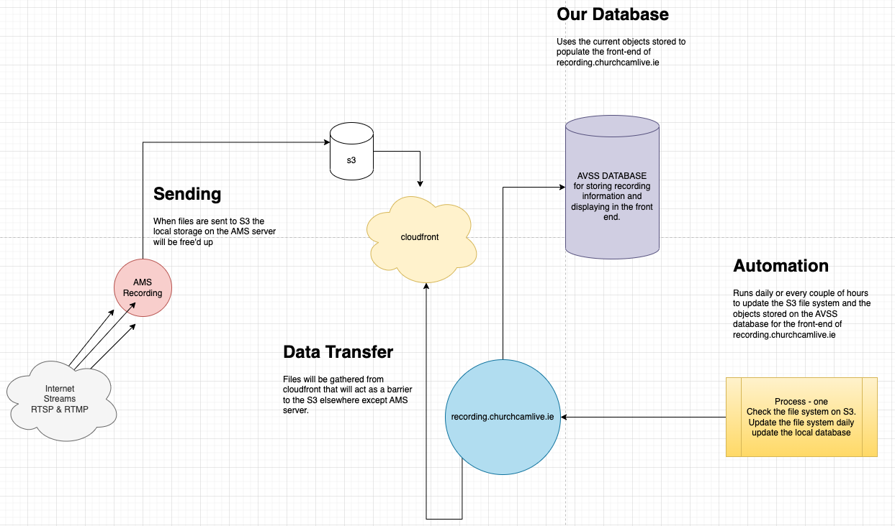

# mp4-url-recorder

Project Owners: Kristian Colville, Declan O'Sullivan

<h2>Link here</h2>

 

## Table of Contents

* [Project Goals](#project-goals)
  * [User Goals](#user-goals)
  * [Site Owners Goals](#site-owners-goals)
* [User Experience](#user-experience)
  * [Target Audience](#target-audience)
  * [User Requirements and Expectations](#user-requirements-and-expectations)
  * [User Stories](#user-stories)
* [Agile Methodology](#agile-methodology)
  * [Epics](#epics)
* [Design](#design)
  * [Color Scheme](#color-scheme)
  * [Typography](#typography)
  * [Structure](#structure)
    * [Wireframes](#wireframes)
* [Business Model](#business-model)
  * [Goals](#goals)
  * [Target Audience](#target-audience)
  * [Strategy](#strategy)
* [Information Architecture](#information-architecture)
  * [Database](#database)
  * [Data Modeling](#data-modeling)
* [Features](#features)
* [Solutions](#solutions)
* [Testing](#testing)
* [Bugs](#bugs)
* [Technologies &amp; Tools](#technologies--tools)
* [Development &amp; Deployment](#development--deployment)
  * [Version Control](#version-control)
  * [AWS](#aws)
  * [Production Server Guide](#production-server-guide)
* [Definitions](#definitions)

## Project Goals

Build a web application capable of selecting an MP4 recording from an AWS S3. The web application should be capable of using FFMPEG to select a portion of an MP4 file for download. The web application should be user-friendly and have minimalist features to enable a quick and easy user experience.

The web application could also possibly upload the content directly to Vimeo to reduce the time spent using the web application.

### User Goals

To use a web application capable of downloading a specific selection of a recording that is needed for business. To have the option to use an application that lessens the need for a tech-savvy user to perform these actions.

The web application should be straightforward to use so that anyone performing this task can easily understand how to operate the web application.

### Site Owners Goals

- Create a website that manages all of the complicated processes that are involved in getting a recording.
- Simplify the experience and speed up the time to acquire a recording.
- Build a powerful web application capable of performing CRUD functionality along with advanced programming capabilities.
- Using FFMPEG select a portion of a file from a request header and use that to chop a selection so it can be given to a customer when requested.
- Take the burden of storage for camera recordings to increase potential availability and revenue.
  Increase the reliability of the service.
- Run the web application smoothly so advertising can commence on the product.

[Back to Top](#table-of-contents)

## User Experience

### Target Audience

Any staff member tasked with collecting a recording and giving the result to the customer.

### User Requirements and Expectations

- Simplicity throughout the website for clear navigation to complete a recording.
- Information is structured in an organized and easy-to-follow manner.
- The CRUD functionality works as expected with feedback provided for each appropriate response.
- The simplicity is perfectly implemented with no unnecessary complexity diminishing the user experience.
- All personal information is securely stored and protected.

### User Stories

User roles:

    User,
    Staff Member,
    Customer,
    Marketer,
    Site Owner

| Issue ID | User Story |
| -------- | ---------- |
|          |            |
|          |            |
|          |            |
|          |            |
|          |            |
|          |            |
|          |            |
|          |            |
|          |            |
|          |            |
|          |            |
|          |            |
|          |            |
|          |            |

[Back to Top](#table-of-contents)

## Agile Methodology

### Epics

[Back to Top](#table-of-contents)

## Design

### Color Scheme

### Typography

### Structure

#### Wireframes

Home page

Streams page

Stream Selection

[Back to Top](#table-of-contents)

## Business Model

### Goals

### Target Audience

### Strategy

[Back to Top](#table-of-contents)

## Information Architecture

Before Development:

During Development:

### Database

### Data Modeling

#### Model table example

| Name | Database Key | Field Type | Validation |
| ---- | ------------ | ---------- | ---------- |
|      |              |            |            |
|      |              |            |            |
|      |              |            |            |
|      |              |            |            |
|      |              |            |            |
|      |              |            |            |
|      |              |            |            |
|      |              |            |            |

[Back to Top](#table-of-contents)

## Features

[Back to Top](#table-of-contents)

## Solutions

Overview of the problem:
Currently, it is difficult to obtain recordings from our primary source as they are typically overwritten.

We want the recordings as these hold value and we can sell the recordings.

We cannot advertise our product as the product is unreliable on our end.

The product can be easily more reliable and viable if we take responsibility for ourselves and obtain the recordings through our storage systems.

### Goal Reminder

Built a web app and a method of automation that can store and manage recordings. The storage system needs to be
within budget and capable of quick access. The automated system should help us identify recordings from the front end of the web app.

### Needs

It needs to be able to store the recordings neatly inside the S3 within days 1 - 31 and the church name folders within those. The reason being it will help when the bot is able to read the folders properly.

### Solutions

#### Antmedia Server

A bot can be used to turn off the streams that are on 24/7. The bot will wait 2 minutes and then turn them back on. This is to enable the transfer of a recording to the S3 bucket.

#### CloudFront & S3

These services are activated and working properly. To use the S3 effectively and get the free tier of transfer allowence cloudfront is used in front of the S3 when requesting data. I have allowed access to the S3 externally so that AntMediaServer can send recordings directly to the storage system.

#### FFMPEG & Recording

I built a test and proved that it is possible to download from the S3 directly and through CloudFront. You can also download a specific selection. The option also exists here to get additional data from an MP4 file such as duration and other headers available in the request.

#### Downloading from Website

This is more complicated as it will likely need to be attached to a database model and then access will need to granted inorder to download it through a link. I am keeping the Vimeo API option there incase this might be easier to send directly to the end destination.

#### Database & Front-End

Once the file architecture is sorted in the S3 I will be able to create a complex algorithm to parse through the data and update a local database on the production server that will store the models and they will be viewable from the front-end. It will help us parse through the files quicker and download content faster. I'm currently investigating options for this functionality.

[Back to Top](#table-of-contents)

## Testing

Please go to the testing [documentation.](TESTING.md)

## Bugs

| Issue ID                                                          | Expected Behaviour                                                                                        | Behaviour reported                                                                                                                                                            | Bug Fix                                     |
| ----------------------------------------------------------------- | --------------------------------------------------------------------------------------------------------- | ----------------------------------------------------------------------------------------------------------------------------------------------------------------------------- | ------------------------------------------- |
| [#1](https://github.com/KristianColville1/mp4-url-recorder/issues/1) | S3 mounting to production server and the streams sending files to the churchcamlive-recordings directory. | Broken directory, symlink broken when recording.                                                                                                                              | working on an alternate solution externally |
| [#3](https://github.com/KristianColville1/mp4-url-recorder/issues/3) | Naming of folders to be /day-one/church-name/name_of_file.mp4                                             | Naming of folders is set and will be /streams/name_of_file.mp4. Bad because it complicates the rest of the web application. Needs to be sorted asap for development purposes. |                                             |
|                                                                   |                                                                                                           |                                                                                                                                                                               |                                             |
|                                                                   |                                                                                                           |                                                                                                                                                                               |                                             |
|                                                                   |                                                                                                           |                                                                                                                                                                               |                                             |
|                                                                   |                                                                                                           |                                                                                                                                                                               |                                             |
|                                                                   |                                                                                                           |                                                                                                                                                                               |                                             |
|                                                                   |                                                                                                           |                                                                                                                                                                               |                                             |
|                                                                   |                                                                                                           |                                                                                                                                                                               |                                             |
|                                                                   |                                                                                                           |                                                                                                                                                                               |                                             |
|                                                                   |                                                                                                           |                                                                                                                                                                               |                                             |
|                                                                   |                                                                                                           |                                                                                                                                                                               |                                             |
|                                                                   |                                                                                                           |                                                                                                                                                                               |                                             |
|                                                                   |                                                                                                           |                                                                                                                                                                               |                                             |
|                                                                   |                                                                                                           |                                                                                                                                                                               |                                             |
|                                                                   |                                                                                                           |                                                                                                                                                                               |                                             |

[Back to Top](#table-of-contents)

## Technologies & Tools

- [Amazon Web Services EC2](https://aws.amazon.com)
- [Mockplus](https://mockplus.com) for wireframing.
- [VSCode](https://vscode.com) for testing and development.
  [FFMPEG Python](https://pypi.org/project/ffmpeg-python/) is not to be confused with the reverse package of the same name, used for fetching and trimming recordings.
- [APScheduler](https://pypi.org/project/APScheduler/) is a package that enables storing persistent jobs in the database using Django's ORM.

[Back to Top](#table-of-contents)

## Development & Deployment

### Version Control

I used [Visual Studio Code](https://code.visualstudio.com/) as a local repository and IDE & [GitHub](https://github.com/) as a remote repository.

1. Firstly, I needed to create a new repository on GitHub [mp4-url-recorder](https://github.com/KristianColville1/mp4-url-recorder).
2. I opened that repository on my local machine by copying the URL from that repository and cloning it from my IDE for use.
3. Visual Studio Code opened a new workspace for me.
4. I created files and folders to use.
5. To push my newly created files to GitHub I used the terminal by pressing Ctrl + shift + `.
6. A new terminal opened and then I used the below steps.

   - git add (name of the file) *This selects the file for the commit*
   - git commit -m "Commit message: (i.e. Initial commit)" *Allows the developer to assign a specific concise statement to the commit*
   - git push *The final command sends the code to GitHub*

### AWS

Please refer to the documentation [here](AWS_S3.md) for the guide on building AWS S3 buckets.

### Production Server Guide

Please follow this link to the [guide](set_up_production_server.md) for adding everything to the production server.

[Back to Top](#table-of-contents)

## Definitions

#### M3U8 File:

A file with the M3U8 file extension is a UTF-8 Encoded Audio Playlist file. They are plain text files that can be used by both audio and video players to describe where media files are located. They essentially point to the file or files that hold the requested content.

The file can use absolute paths, relative paths, and URLs to refer to specific media files and/or entire folders of media files. Other information in the file might comment that describes the contents.

#### FFMPEG:

Fast Forward MPEG

(Fast Forward MPEG) An open-source multimedia project for working with audio and video. Based on the "libavcodec" A/V codec library and "libavformat" multiplexing framework, FFmpeg is a command-line utility that can encode and decode a variety of media formats.

It is widely used for format transcoding, basic editing (trimming and concatenation), video scaling, and video post-production effects.

Originally written in C and Assembly language.

[Back to Top](#table-of-contents)
