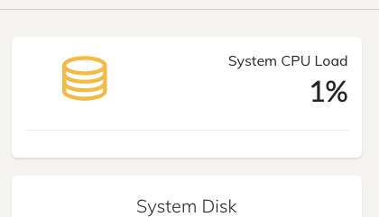

# mp4-url-recorder

Project Owners: Kristian Colville, Declan O'Sullivan

<h2>Link here</h2>

<br>

## Table of Contents

* [Project Goals](#project-goals)
  * [User Goals](#user-goals)
  * [Site Owners Goals](#site-owners-goals)
* [User Experience](#user-experience)
  * [Target Audience](#target-audience)
  * [User Requirements and Expectations](#user-requirements-and-expectations)
  * [User Stories](#user-stories)
* [Agile Methodology](#agile-methodology)
  * [Epics](#epics)
* [Design](#design)
  * [Color Scheme](#color-scheme)
  * [Typography](#typography)
  * [Structure](#structure)
    * [Wireframes](#wireframes)
* [Business Model](#business-model)
  * [Goals](#goals)
  * [Target Audience](#target-audience)
  * [Strategy](#strategy)
* [Information Architecture](#information-architecture)
  * [Database](#database)
  * [Data Modeling](#data-modeling)
* [Features](#features)
* [Solutions](#solutions)
* [Testing](#testing)
* [Bugs](#bugs)
* [Technologies &amp; Tools](#technologies--tools)
* [Development &amp; Deployment](#development--deployment)
  * [Version Control](#version-control)
  * [AWS](#aws)
  * [Production Server Guide](#production-server-guide)
* [Definitions](#definitions)

## Project Goals

Build a web application capable of selecting an MP4 recording from an AWS S3. The web application should be capable of using FFMPEG to select a portion of an MP4 file for download. The web application should be user-friendly and have minimalist features to enable a quick and easy user experience.

The web application could also possibly upload the content directly to Vimeo to reduce the time spent using the web application.

### User Goals

To use a web application capable of downloading a specific selection of a recording that is needed for business. To have the option to use an application that lessens the need for a tech-savvy user to perform these actions.

The web application should be straightforward to use so that anyone performing this task can easily understand how to operate the web application.

### Site Owners Goals

- Create a website that manages all of the complicated processes that are involved in getting a recording.
- Simplify the experience and speed up the time to acquire a recording.
- Build a powerful web application capable of performing CRUD functionality along with advanced programming capabilities.
- Using FFMPEG select a portion of a file from a request header and use that to chop a selection so it can be given to a customer when requested.
- Take the burden of storage for camera recordings to increase potential availability and revenue.
  Increase the reliability of the service.
- Run the web application smoothly so advertising can commence on the product.

[Back to Top](#table-of-contents)

## User Experience

### Target Audience

Any staff member tasked with collecting a recording and giving the result to the customer.

### User Requirements and Expectations

- Simplicity throughout the website for clear navigation to complete a recording.
- Information is structured in an organized and easy-to-follow manner.
- The CRUD functionality works as expected with feedback provided for each appropriate response.
- The simplicity is perfectly implemented with no unnecessary complexity diminishing the user experience.
- All personal information is securely stored and protected.

### User Stories

User roles:

    User,
    Staff Member,
    Customer,
    Marketer,
    Site Owner

| Issue ID | User Story |
| -------- | ---------- |
|          |            |
|          |            |
|          |            |
|          |            |
|          |            |
|          |            |
|          |            |
|          |            |
|          |            |
|          |            |
|          |            |
|          |            |
|          |            |
|          |            |

[Back to Top](#table-of-contents)

## Agile Methodology

### Epics

[Back to Top](#table-of-contents)

## Design

### Color Scheme

### Typography

### Structure

#### Wireframes

Home page


Streams page


Stream Selection


[Back to Top](#table-of-contents)

## Business Model

### Goals

### Target Audience

### Strategy

[Back to Top](#table-of-contents)

## Information Architecture


### Database

### Data Modeling

#### Model table example

| Name | Database Key | Field Type | Validation |
| ---- | ------------ | ---------- | ---------- |
|      |              |            |            |
|      |              |            |            |
|      |              |            |            |
|      |              |            |            |
|      |              |            |            |
|      |              |            |            |
|      |              |            |            |
|      |              |            |            |

[Back to Top](#table-of-contents)

## Features

[Back to Top](#table-of-contents)

## Solutions

Overview of the problem:

Currently it is difficult to obtain recordings from our primary source as they are typically overwritten.

We want the recordings as these hold value and we can sell the recordings.

We cannot advertise our product as the product is unreliable on our end.

The product can be easily more reliable and viable if we take the responsibility on to ourselves and obtain the recordings through our own storage systems.

### Goal Reminder

Built a web app and a method of automation that can store and manage recordings. The storage system needs to be
within budget and capable of quick access. The automated system should help us identify recordings from the front-end of the web app.

### Possible topologies and solutions

  Solution A:

* The storage system chosen is an AWS S3 bucket.
* The method of automation is web scraping and web hooks using python.
* Web app stack is built using django.
* Gunicorn will be left running consistently.
* The server will be a small OVH VPS.
* The server estimated size will be tested using EC2s from AWS.
* All of the systems will be help in one repository.

  Solution B:

* Build a desktop application or script that can be used to fetch recordings.
* This solution is currently in development as it adds different challanges to the storing of recordings.

  Solution C:

* This would be similar to solution A
* Probably need to use boto3 instead of python bot for manipulating objects in S3

### Needs

It needs to be able to store the recordings neatly inside the S3 within days 1 - 31 and the church name folders within those. The reason being it will help when the bot is able to read the folders properly.

[Back to Top](#table-of-contents)

## Testing

Large Tests to Perform:

  Bots:

* Automate the recordings and delete recordings accordingly on the system.
* Create a file system toplogy that can be used for the website to improve the UI/UX design.

  FFMPEG:

* Saving an mp4 file to an s3 bucket and downloading it from the website
* Selecting a portion of a mp4 file from an s3 bucket and downloading.

### Challenges

* File storage
* Recording 24/7 hr streams
* Automation
* FFMPEG use on HTML headers
* Data translation from file storage to the Front-End
* Cloudfront added infront of S3 (will need to be able go through cloudfront to get data)

### Tests

#### Test 1

- Checking file formatting in S3 with Dollymount (clone of real stream on testing server).

  1. Created an S3 bucket and EC2 with AntMediaServer installed.
  2. Added S3 bucket credentials to the AMS server.

  | Image / Code                                                    | Result                                                                                                                                                                           | Considerations                                                                                                                                                                   | Additional                                                                                                                |
  | --------------------------------------------------------------- | -------------------------------------------------------------------------------------------------------------------------------------------------------------------------------- | -------------------------------------------------------------------------------------------------------------------------------------------------------------------------------- | ------------------------------------------------------------------------------------------------------------------------- |
  |  | I added the credentials and tested recording a stream and these are the results. Saves in multipe formats, need to decipher whats needed for FFMPEG to parse.                    | Removal of additional files possibly not needed. Files definitely need to be time stamped. MP4 file only shows once the stream has stopped (or incase of 24/7 stream is stopped) | The folder architecture of 1 - 31 days will have to be looked at as it's unclear if this can be done from the AMS server. |
  |       | After uploading to S3 bucket the storage goes down properly to 24.1MB, it went up as I turned it back on                                                                         | local storage won't be impacted with multiple stream recording as AMS will delete files once completed and sent to S3                                                            | This significantly reduces resource consumption on the server                                                             |
  |              | One stream recording and cpu is responding well. Will need a larger test peformed on the production server to gather more information but I suspect an upgrade to be possible... | -------                                                                                                                                                                          | -------                                                                                                                   |

#### Test 2

- Creating a script to pull an mp4 file from the S3.
  | Image / Code                                              | Result                                                             | Considerations                                                                         | Additional                                                                                                                                                                       |
  | --------------------------------------------------------- | ------------------------------------------------------------------ | -------------------------------------------------------------------------------------- | -------------------------------------------------------------------------------------------------------------------------------------------------------------------------------- |
  |  | successfully got 2 minutes of a stream using ffmpeg-python package | package is highly accessible, easy to read and small enough to parse in a few minutes. | The base structure for downloading with urls is built, however the front-end complicates the design. Needs additoinal information such as the file architure issue to be sorted. |

Example code written.

```
FROM = '00:00:00'
TO = '00:02:00'
name_of_new_file = 'test.mp4'
ffmpeg.input(url_to_download, ss=FROM, t=TO).output(
    name_of_new_file, vcodec='copy', acodec='copy').overwrite_output().run()
```

What does this mean?

Well it means the meta data we need is attached to the mp4 file and that's excellent in getting the recordings. This code can be adapted to calculate the time difference. The total time of the file will need to extracted in order to help determine ranges for the user to trim.

It also means we don't need to download the whole file each time we need a selection from an mp4 file.

#### Test 3

- Running a python script in the background continously as a cron job

Link to material for cronjob [here](https://medium.com/analytics-vidhya/easiest-way-to-run-a-python-script-in-the-background-4aada206cf29#:~:text=The%20easiest%20way%20of%20running,can%20use%20Windows%20Task%20Scheduler.&text=You%20can%20then%20give%20the,by%20giving%20the%20time%20particulars.).

This test includes writing a script to send an email every 5 minutes to a new email address. By running it constantly we can help prove this functionality and consider it on features of the project. Specifically the automation elements requiring moving of files and updating a front-end database.

Each test will help prove the functionality for each of features as a whole in the project.

Cronjobs are processes that run in the background and they specifiy how often to run each process that's created as a cronjob.


[Back to Top](#table-of-contents)

## Bugs

| Issue ID                                                          | Expected Behaviour                                                                                        | Behaviour reported                                                                                                                                                            | Bug Fix                                     |
| ----------------------------------------------------------------- | --------------------------------------------------------------------------------------------------------- | ----------------------------------------------------------------------------------------------------------------------------------------------------------------------------- | ------------------------------------------- |
| [#1](https://github.com/KristianColville1/mp4-url-recorder/issues/1) | S3 mounting to production server and the streams sending files to the churchcamlive-recordings directory. | Broken directory, symlink broken when recording.                                                                                                                              | working on an alternate solution externally |
| [#3](https://github.com/KristianColville1/mp4-url-recorder/issues/3) | Naming of folders to be /day-one/church-name/name_of_file.mp4                                             | Naming of folders is set and will be /streams/name_of_file.mp4. Bad because it complicates the rest of the web application. Needs to be sorted asap for development purposes. |                                             |
|                                                                   |                                                                                                           |                                                                                                                                                                               |                                             |
|                                                                   |                                                                                                           |                                                                                                                                                                               |                                             |
|                                                                   |                                                                                                           |                                                                                                                                                                               |                                             |
|                                                                   |                                                                                                           |                                                                                                                                                                               |                                             |
|                                                                   |                                                                                                           |                                                                                                                                                                               |                                             |
|                                                                   |                                                                                                           |                                                                                                                                                                               |                                             |
|                                                                   |                                                                                                           |                                                                                                                                                                               |                                             |
|                                                                   |                                                                                                           |                                                                                                                                                                               |                                             |
|                                                                   |                                                                                                           |                                                                                                                                                                               |                                             |
|                                                                   |                                                                                                           |                                                                                                                                                                               |                                             |
|                                                                   |                                                                                                           |                                                                                                                                                                               |                                             |
|                                                                   |                                                                                                           |                                                                                                                                                                               |                                             |
|                                                                   |                                                                                                           |                                                                                                                                                                               |                                             |
|                                                                   |                                                                                                           |                                                                                                                                                                               |                                             |

[Back to Top](#table-of-contents)

## Technologies & Tools

- [Amazon Web Services EC2](https://aws.amazon.com)
- [Mockplus](https://mockplus.com) for wireframing.
- [VSCode](https://vscode.com) for testing and development.
- [FFMPEG Python](https://pypi.org/project/ffmpeg-python/) not to be confused with the reverse package of the same name, used for fetching and trimming recordings.

[Back to Top](#table-of-contents)

## Development & Deployment

### Version Control

I used [Visual Studio Code](https://code.visualstudio.com/) as a local repository and IDE & [GitHub](https://github.com/) as a remote repository.

1. Firstly, I needed to create a new repository on Github [mp4-url-recorder](https://github.com/KristianColville1/mp4-url-recorder).
2. I opened that repository on my local machine by copying the URL from that repository and cloning it from my IDE for use.
3. Visual Studio Code opened a new workspace for me.
4. I created files and folders to use.
5. To push my newly created files to GitHub I used the terminal by pressing Ctrl + shift + `.
6. A new terminal opened and then I used the below steps.

   - git add (name of the file) *This selects the file for the commit*
   - git commit -m "Commit message: (i.e. Initial commit)" *Allows the developer to assign a specific concise statement to the commit*
   - git push *The final command sends the code to GitHub*

### AWS

### Production Server Guide

[Please follow this link to the guide](set_up_production_server.md)

[Back to Top](#table-of-contents)

## Definitions

#### M3U8 File:

A file with the M3U8 file extension is a UTF-8 Encoded Audio Playlist file. They are plain text files that can be used by both audio and video players to describe where media files are located. They essentially point to the file or files that hold the requested content.

The file can use absolute paths, relative paths, and URLs to refer to specific media files and/or entire folders of media files. Other information in the file might be comments that describe the contents.

#### FFMPEG:

Fast Forward MPEG

(Fast Forward MPEG) An open source multimedia project for working with audio and video. Based on the "libavcodec" A/V codec library and "libavformat" multiplexing framework, FFmpeg is a command-line utility that can encode and decode a variety of media formats.

It is widely used for format transcoding, basic editing (trimming and concatenation), video scaling, and video post-production effects.

Originally written in C and Assembly language.

[Back to Top](#table-of-contents)
