# mp4-url-recorder

Project Owners: Kristian Colville, Declan O'Sullivan

<h2>Link here</h2>

 

## Table of Contents

* [Project Goals](#project-goals)
  * [User Goals](#user-goals)
  * [Site Owners Goals](#site-owners-goals)
* [User Experience](#user-experience)
  * [Target Audience](#target-audience)
  * [User Requirements and Expectations](#user-requirements-and-expectations)
  * [User Stories](#user-stories)
* [Agile Methodology](#agile-methodology)
  * [Epics](#epics)
* [Design](#design)
  * [Color Scheme](#color-scheme)
  * [Typography](#typography)
  * [Structure](#structure)
    * [Wireframes](#wireframes)
* [Business Model](#business-model)
  * [Goals](#goals)
  * [Target Audience](#target-audience)
  * [Strategy](#strategy)
* [Information Architecture](#information-architecture)
  * [Database](#database)
  * [Data Modeling](#data-modeling)
* [Features](#features)
* [Solutions](#solutions)
* [Testing](#testing)
* [Bugs](#bugs)
* [Technologies &amp; Tools](#technologies--tools)
* [Development &amp; Deployment](#development--deployment)
  * [Version Control](#version-control)
  * [AWS](#aws)
  * [Production Server Guide](#production-server-guide)
* [Definitions](#definitions)

## Project Goals

Build a web application capable of selecting an MP4 recording from an AWS S3. The web application should be capable of using FFMPEG to select a portion of an MP4 file for download. The web application should be user-friendly and have minimalist features to enable a quick and easy user experience.

The web application could also possibly upload the content directly to Vimeo to reduce the time spent using the web application.

### User Goals

To use a web application capable of downloading a specific selection of a recording that is needed for business. To have the option to use an application that lessens the need for a tech-savvy user to perform these actions.

The web application should be straightforward to use so that anyone performing this task can easily understand how to operate the web application.

### Site Owners Goals

- Create a website that manages all of the complicated processes that are involved in getting a recording.
- Simplify the experience and speed up the time to acquire a recording.
- Build a powerful web application capable of performing CRUD functionality along with advanced programming capabilities.
- Using FFMPEG select a portion of a file from a request header and use that to chop a selection so it can be given to a customer when requested.
- Take the burden of storage for camera recordings to increase potential availability and revenue.
  Increase the reliability of the service.
- Run the web application smoothly so advertising can commence on the product.

[Back to Top](#table-of-contents)

## User Experience

### Target Audience

Any staff member tasked with collecting a recording and giving the result to the customer.

### User Requirements and Expectations

- Simplicity throughout the website for clear navigation to complete a recording.
- Information is structured in an organized and easy-to-follow manner.
- The CRUD functionality works as expected with feedback provided for each appropriate response.
- The simplicity is perfectly implemented with no unnecessary complexity diminishing the user experience.
- All personal information is securely stored and protected.

### User Stories

User roles:

    User,
    Staff Member,
    Customer,
    Marketer,
    Site Owner

| Issue ID | User Story |
| -------- | ---------- |
|          |            |
|          |            |
|          |            |
|          |            |
|          |            |
|          |            |
|          |            |
|          |            |
|          |            |
|          |            |
|          |            |
|          |            |
|          |            |
|          |            |

[Back to Top](#table-of-contents)

## Agile Methodology

### Epics

[Back to Top](#table-of-contents)

## Design

### Color Scheme

### Typography

### Structure

#### Wireframes

Home page

Streams page

Stream Selection

[Back to Top](#table-of-contents)

## Business Model

### Goals

### Target Audience

### Strategy

[Back to Top](#table-of-contents)

## Information Architecture

Before Development:

During Development:

### Database

### Data Modeling

#### Model table example

| Name | Database Key | Field Type | Validation |
| ---- | ------------ | ---------- | ---------- |
|      |              |            |            |
|      |              |            |            |
|      |              |            |            |
|      |              |            |            |
|      |              |            |            |
|      |              |            |            |
|      |              |            |            |
|      |              |            |            |

[Back to Top](#table-of-contents)

## Features

[Back to Top](#table-of-contents)

## Solutions

Overview of the problem:
Currently, it is difficult to obtain recordings from our primary source as they are typically overwritten.

We want the recordings as these hold value and we can sell the recordings.

We cannot advertise our product as the product is unreliable on our end.

The product can be easily more reliable and viable if we take responsibility for ourselves and obtain the recordings through our storage systems.

### Goal Reminder

Built a web app and a method of automation that can store and manage recordings. The storage system needs to be
within budget and capable of quick access. The automated system should help us identify recordings from the front end of the web app.

### Possible topologies and solutions

  Solution A:

* The storage system chosen is an AWS S3 bucket.
* The method of automation is web scraping and webhooks using python.
* The web app stack is built using Django.
* Gunicorn will be left running consistently.
* The server will be a small OVH VPS.
* The server's estimated size will be tested using EC2s from AWS.
* All of the systems will be held in one repository.

  Solution B:

* Build a desktop application or script that can be used to fetch recordings.
* This solution is currently in development as it adds different challenges to the storing of recordings.

  Solution C:

* This would be similar to solution A
* Probably need to use boto3 instead of python bot for manipulating objects in S3

### Needs

It needs to be able to store the recordings neatly inside the S3 within days 1 - 31 and the church name folders within those. The reason being it will help when the bot is able to read the folders properly.

[Back to Top](#table-of-contents)

## Testing

Please go to the testing [documentation.](TESTING.md)

## Bugs

| Issue ID                                                          | Expected Behaviour                                                                                        | Behaviour reported                                                                                                                                                            | Bug Fix                                     |
| ----------------------------------------------------------------- | --------------------------------------------------------------------------------------------------------- | ----------------------------------------------------------------------------------------------------------------------------------------------------------------------------- | ------------------------------------------- |
| [#1](https://github.com/KristianColville1/mp4-url-recorder/issues/1) | S3 mounting to production server and the streams sending files to the churchcamlive-recordings directory. | Broken directory, symlink broken when recording.                                                                                                                              | working on an alternate solution externally |
| [#3](https://github.com/KristianColville1/mp4-url-recorder/issues/3) | Naming of folders to be /day-one/church-name/name_of_file.mp4                                             | Naming of folders is set and will be /streams/name_of_file.mp4. Bad because it complicates the rest of the web application. Needs to be sorted asap for development purposes. |                                             |
|                                                                   |                                                                                                           |                                                                                                                                                                               |                                             |
|                                                                   |                                                                                                           |                                                                                                                                                                               |                                             |
|                                                                   |                                                                                                           |                                                                                                                                                                               |                                             |
|                                                                   |                                                                                                           |                                                                                                                                                                               |                                             |
|                                                                   |                                                                                                           |                                                                                                                                                                               |                                             |
|                                                                   |                                                                                                           |                                                                                                                                                                               |                                             |
|                                                                   |                                                                                                           |                                                                                                                                                                               |                                             |
|                                                                   |                                                                                                           |                                                                                                                                                                               |                                             |
|                                                                   |                                                                                                           |                                                                                                                                                                               |                                             |
|                                                                   |                                                                                                           |                                                                                                                                                                               |                                             |
|                                                                   |                                                                                                           |                                                                                                                                                                               |                                             |
|                                                                   |                                                                                                           |                                                                                                                                                                               |                                             |
|                                                                   |                                                                                                           |                                                                                                                                                                               |                                             |
|                                                                   |                                                                                                           |                                                                                                                                                                               |                                             |

[Back to Top](#table-of-contents)

## Technologies & Tools

- [Amazon Web Services EC2](https://aws.amazon.com)
- [Mockplus](https://mockplus.com) for wireframing.
- [VSCode](https://vscode.com) for testing and development.
[FFMPEG Python](https://pypi.org/project/ffmpeg-python/) is not to be confused with the reverse package of the same name, used for fetching and trimming recordings.

[Back to Top](#table-of-contents)

## Development & Deployment

### Version Control

I used [Visual Studio Code](https://code.visualstudio.com/) as a local repository and IDE & [GitHub](https://github.com/) as a remote repository.

1. Firstly, I needed to create a new repository on GitHub [mp4-url-recorder](https://github.com/KristianColville1/mp4-url-recorder).
2. I opened that repository on my local machine by copying the URL from that repository and cloning it from my IDE for use.
3. Visual Studio Code opened a new workspace for me.
4. I created files and folders to use.
5. To push my newly created files to GitHub I used the terminal by pressing Ctrl + shift + `.
6. A new terminal opened and then I used the below steps.

   - git add (name of the file) *This selects the file for the commit*
   - git commit -m "Commit message: (i.e. Initial commit)" *Allows the developer to assign a specific concise statement to the commit*
   - git push *The final command sends the code to GitHub*

### AWS

For this project, I used the AWS S3 bucket for storing static files. If you would like to also do the same or create a new one please follow my instructions to create an S3 bucket. I wouldn't consider the AWS console to be the most user-friendly tool so follow my instructions carefully.

1. Sign in to [AWS](https://aws.amazon.com/console/).

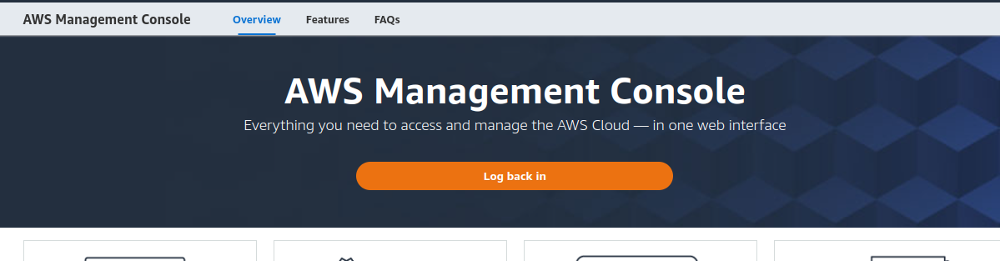

2. If you don't have an AWS account create one and add your credit card details

Be mindful of charges on your account. Use free-tier products and don't go overboard. You can check your account in the top right corner of the screen by clicking on the username you chose when creating an account. There you will see multiple options to check your account and billing information

3. Once you have successfully logged in navigate to the top left corner of the page where the AWS logo and services are located

4. You'll see a search bar. Type in S3 and select the one called S3 from the list of options

5. You'll be brought to the main dashboard for AWS S3 and you can create a bucket here. The button to create a bucket is located on the right-hand side of the screen

6. Click the button and enter the information I have below and change the name of the bucket to your preferred chosen bucket name (usually made identifiable by your project name). Choose your preferred location also. To access the bucket publicly you need to allow access

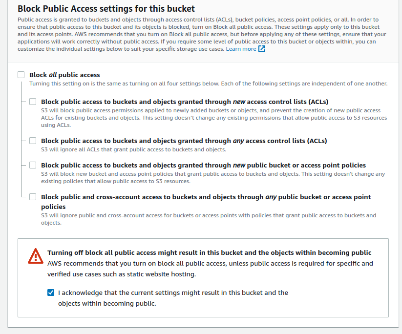

7. On this page, those are the only settings that need configuration so click 'create bucket' at the end of the page

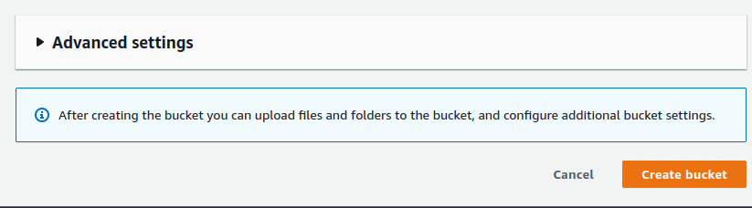

8. You'll be brought to your AWS S3 buckets page. Click on the bucket you just created

9. Navigate to the properties tab of your bucket and find you should find static hosting in the list (at the time of writing it is at the bottom of the page) so click edit

10. Enable static hosting and add in index.html and error.html (these don't matter but need a config for this project) and click save changes at the bottom of the screen

11. You'll be brought back to the bucket dashboard for your bucket the next thing to do is to configure permissions. We have three tasks to do in the permissions tab

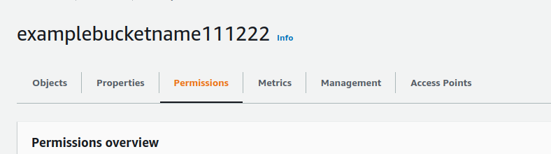

12. We need to add a bucket policy so click edit here and then let's use the policy generator

13. You'll be brought to a new tab to create your policy.

- The type of policy is the S3 Bucket policy
- The principal is a * symbol so we can access everything in our bucket
- We only need to perform one action and its 'GetObject' the mp4 recorder requires all permissions
- The ARN can be found on the previous tab at the top of the page
- Click add statement
- Then click Generate Policy
- We have no special conditions to add to this project

- Copy the policy generated using Ctrl + a and Ctrl + c or using your mouse

14. Switch tabs back to your edit bucket policy page and paste the generated policy into the text editor area. We want to use all the resources in the bucket so we're not finished yet here.
In the policy you can see a key for "Resource" and at the end of the value add /* so we can access all items inside the bucket then click save changes at the bottom of the screen

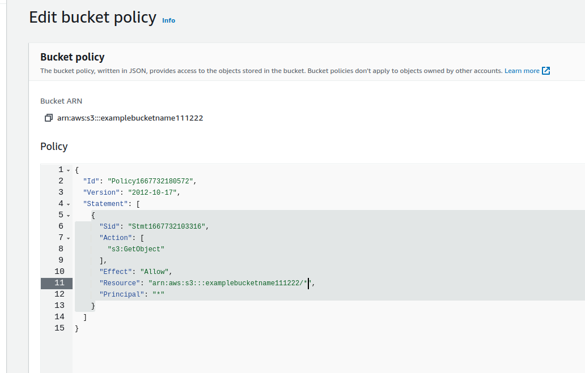

15. The second task we need to complete here in the permissions tab of the bucket is configuring the Access control list. It allows users to access the bucket. Click edit

- You only need to change one setting here for Everyone to have public access and you only want to change the list

- Accept that you understand these changes for granting access and click save changes

16. The last step for the S3 bucket is to go to the very end of this tab section under permissions and add a CORS configuration. Click edit and paste the following code block

    [
        {
        "AllowedHeaders": [
        "Authorization"
        ],
        "AllowedMethods": [
        "GET"
        ],
        "AllowedOrigins": [
        "*"
        ],
        "ExposeHeaders": []
        }
    ]

17. We've finished everything we need to do inside our bucket the next thing we need to do is configure our identity and access management settings for accessing our AWS resources. In the search bar enter IAM and select the first option called IAM

18. Click on User groups and create a new user group

- You don't need to do anything yet so just click create a group at the end of the page after you create a name for your user group

19. You'll be brought to the dashboard for your user groups, click on the user group you created
and navigate to permissions

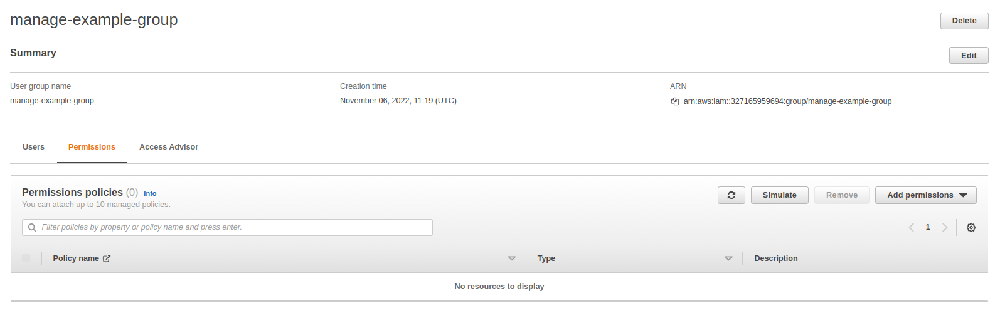

- Click on add permissions and click attach policies

- You will be brought to another page to create your policy, navigate to the JSON tab

- Click on the import-managed policy

- Type in S3 and select the option for full access, when you return the JSON text will have changed

- Remove the value for the Resource key and replace it with your ARN for your S3 Bucket. 
Open a separate tab and navigate to the S3 dashboard and then to your bucket and get the ARN as we did in a previous step. create an array for the Resource key and paste in your ARN twice but for the second value in the array put a /* at the end so we can access the bucket and the contents of the bucket.

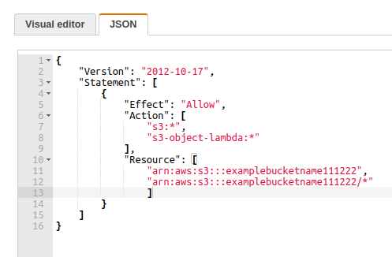

- When completed click next and next again skipping the tag section as it's irrelevant to this project and add a name and description for the policy you created

20. Navigate back to user groups and click on your group go to the permissions tab and let's attach the policy we created

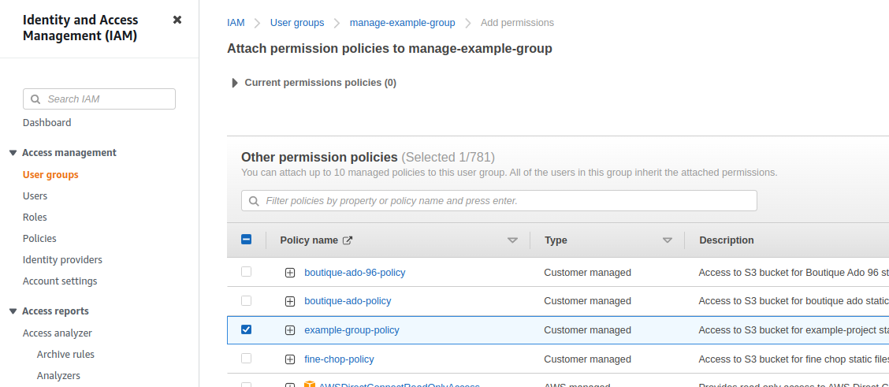

21. The last thing we need to do to complete our setup and access our S3 bucket is to create a user for our user group so they can use the permissions we created

- Navigate to the user sections of our IAM

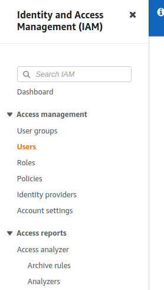

- Click on add a user.

- Create a user for our user group and allow programmatic access so we can use it in our Django project, click next and skip the tag section and click on create user

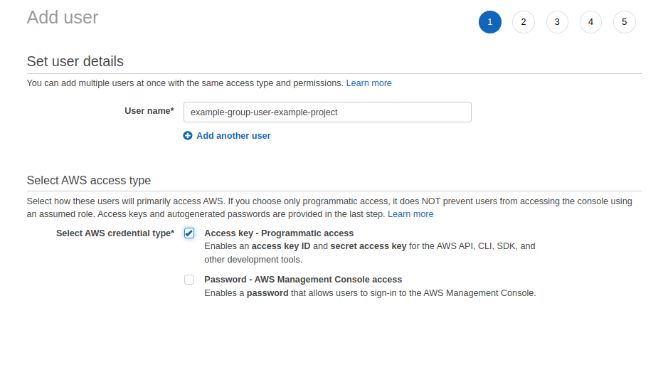

22. We have now completed our set-up for our S3 bucket and we need to download the .csv file for our access key and secret access key. You can also copy those from here to put in your project

23. As a final mention, you must install boto3 and django-storages to use your S3 bucket with Python. Example below.

- In the settings.py file of your project directory paste this and also change the bucket name and region that you chose for your S3 bucket

        # static file config heroku
        # Cache control
        AWS_S3_OBJECT_PARAMETERS = {
            'Expires': 'Thu, 31 Dec 2099 20:00:00 GMT',
            'CacheControl': 'max-age=94608000',
        }

        # Bucket Config
        AWS_STORAGE_BUCKET_NAME = 'fine-chop2'
        AWS_S3_REGION_NAME = 'eu-west-1'
        AWS_ACCESS_KEY_ID = os.environ.get('AWS_ACCESS_KEY_ID')
        AWS_SECRET_ACCESS_KEY = os.environ.get('AWS_SECRET_ACCESS_KEY')
        AWS_S3_CUSTOM_DOMAIN = f'{AWS_STORAGE_BUCKET_NAME}.s3.amazonaws.com'

        # Static and media files
        STATICFILES_STORAGE = 'custom_storages.StaticStorage'
        STATICFILES_LOCATION = 'static'
        DEFAULT_FILE_STORAGE = 'custom_storages.MediaStorage'
        MEDIAFILES_LOCATION = 'media'

- You will also need to configure Django to use your S3 bucket so create a file as below and place it in the main project directory

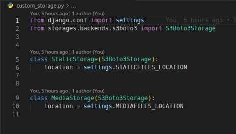

### Production Server Guide

[Please follow this link to the guide](set_up_production_server.md)

[Back to Top](#table-of-contents)

## Definitions

#### M3U8 File:

A file with the M3U8 file extension is a UTF-8 Encoded Audio Playlist file. They are plain text files that can be used by both audio and video players to describe where media files are located. They essentially point to the file or files that hold the requested content.

The file can use absolute paths, relative paths, and URLs to refer to specific media files and/or entire folders of media files. Other information in the file might comment that describes the contents.

#### FFMPEG:

Fast Forward MPEG

(Fast Forward MPEG) An open-source multimedia project for working with audio and video. Based on the "libavcodec" A/V codec library and "libavformat" multiplexing framework, FFmpeg is a command-line utility that can encode and decode a variety of media formats.

It is widely used for format transcoding, basic editing (trimming and concatenation), video scaling, and video post-production effects.

Originally written in C and Assembly language.

[Back to Top](#table-of-contents)
