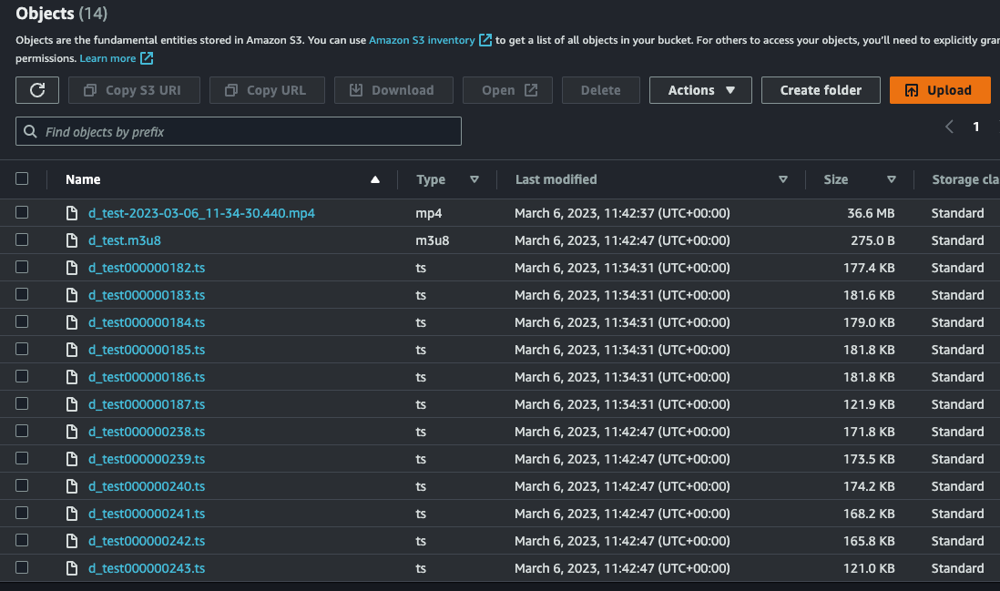
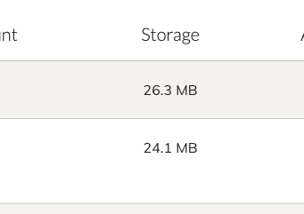
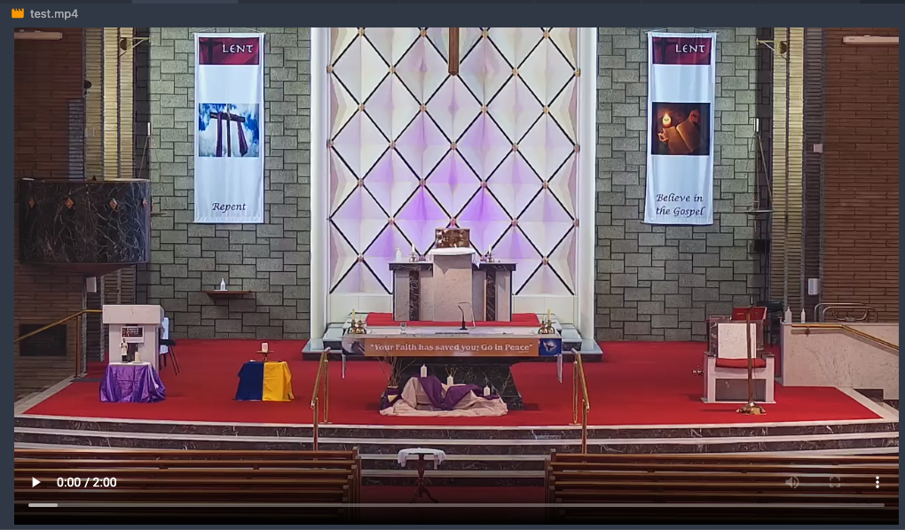
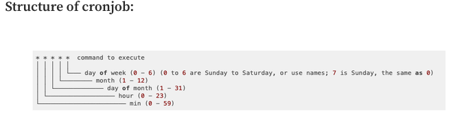
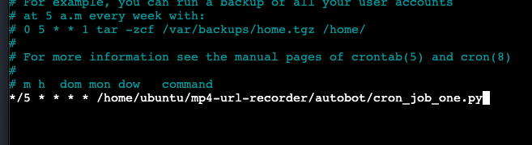
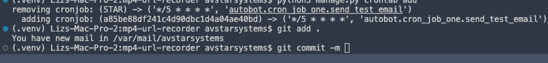
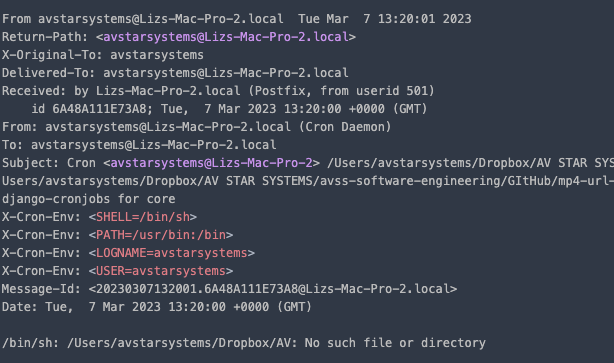
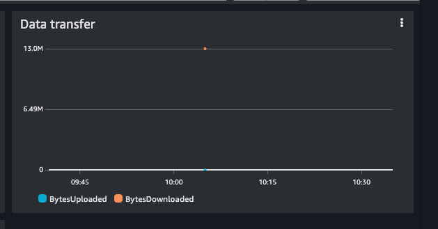
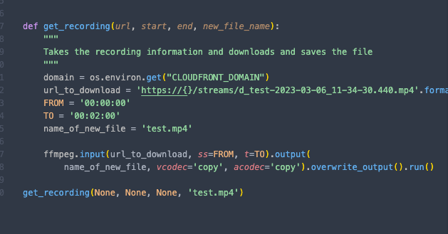
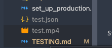

## Table of Contents

* [Testing](#testing)
  * [Test 1](#test-1)
  * [Test 2](#test-1)
  * [Test 3](#test-1)

## Testing

Large Tests to Perform:

  Bots:

* Automate the recordings and delete recordings accordingly on the system.
* Create a file system topology that can be used for the website to improve the UI/UX design.

  FFMPEG:
* Saving an mp4 file to an s3 bucket and downloading it from the website
* Selecting a portion of an mp4 file from an s3 bucket and downloading.

### Challenges

* File storage
* Recording 24/7 hr streams
* Automation
* FFMPEG use on HTML headers
* Data translation from file storage to the Front-End

CloudFront added in front of S3 (will need to be able to go through CloudFront to get data)

### Tests

Each test is part of the larger picture and organisation of the project. This testing below in particular is to test different components of the final project. For example, each test has its alternatives. I will perform tests on each large component to be built in order to prove its useful or look for alternatives.

#### Test 1

- Checking file formatting in S3 with Dollymount (clone of the real stream on the testing server).

  1. Created an S3 bucket and EC2 with AntMediaServer installed.
  2. Added S3 bucket credentials to the AMS server.

  | Image/ Code                                       | Result                                                                                                                                                                           | Considerations                                                                                                                                                                   | Additional                                                                                                                |
  | ------------------------------------------------- | -------------------------------------------------------------------------------------------------------------------------------------------------------------------------------- | -------------------------------------------------------------------------------------------------------------------------------------------------------------------------------- | ------------------------------------------------------------------------------------------------------------------------- |
  |  | I added the credentials and tested recording a stream and these are the results. Saves in multipe formats, need to decipher whats needed for FFMPEG to parse.                    | Removal of additional files possibly not needed. Files definitely need to be time stamped. MP4 file only shows once the stream has stopped (or incase of 24/7 stream is stopped) | The folder architecture of 1 - 31 days will have to be looked at as it's unclear if this can be done from the AMS server. |
  |    | After uploading to S3 bucket the storage goes down properly to 24.1MB, it went up as I turned it back on                                                                         | local storage won't be impacted with multiple stream recording as AMS will delete files once completed and sent to S3                                                            | This significantly reduces resource consumption on the server                                                             |
  |        | One stream recording and cpu is responding well. Will need a larger test peformed on the production server to gather more information but I suspect an upgrade to be possible... |                                                                                                                                                                                  |                                                                                                                           |

#### Test 2

- Creating a script to pull an mp4 file from the S3.| Image/Code                                                | Result                                                             | Considerations                                                                         | Additional                                                                                                                                                                           |
  | --------------------------------------------------------- | ------------------------------------------------------------------ | -------------------------------------------------------------------------------------- | ------------------------------------------------------------------------------------------------------------------------------------------------------------------------------------ |
  |  | successfully got 2 minutes of a stream using ffmpeg-python package | package is highly accessible, easy to read and small enough to parse in a few minutes. | The base structure for downloading with URLs is built, however, the front end complicates the design. Needs additional information such as the file architecture issue to be sorted. |
  |                                                           |                                                                    |                                                                                        |                                                                                                                                                                                      |

An example code is written below.

```

FROM = '00:00:00'

TO = '00:02:00'

name_of_new_file = 'test.mp4'

ffmpeg.input(url_to_download, ss=FROM, t=TO).output(

    name_of_new_file, vcodec='copy', acodec='copy').overwrite_output().run()

```

What does this mean?

Well, it means the metadata we need is attached to the mp4 file and that's excellent for getting the recordings. This code can be adapted to calculate the time difference. The total time of the file will need to extract to help determine ranges for the user to trim.

It also means we don't need to download the whole file each time we need a selection from an mp4 file.

#### Test 3

- Running a python script in the background continuously as a cron job

Link to material for cronjob [here](https://medium.com/analytics-vidhya/easiest-way-to-run-a-python-script-in-the-background-4aada206cf29#:~:text=The%20easiest%20way%20of%20running,can%20use%20Windows%20Task%20Scheduler.&text=You%20can%20then%20give%20the,by%20giving%20the%20time%20particulars.).

This test includes writing a script to send an email every 5 minutes to a new email address. By running it constantly we can help prove this functionality and consider it as the feature of the project. Specifically, the automation elements require moving files and updating a front-end database.

Each test will help prove the functionality of each feature as a whole in the project.

Cronjobs are processes that run in the background and they specify how often to run each process that's created as a cronjob.



What I'm specifically testing is if I run a cronjob on a file does that file have access to the rest of the files in that folder. We can test this by creating a script and importing another file in the same directory to perform actions on. For example, sending emails.

| Image/Code                                                           | Result                                                                                                                                                                                                                | Considerations                                                                                                  | Additional                                                                                                                                                                                 |
| -------------------------------------------------------------------- | --------------------------------------------------------------------------------------------------------------------------------------------------------------------------------------------------------------------- | --------------------------------------------------------------------------------------------------------------- | ------------------------------------------------------------------------------------------------------------------------------------------------------------------------------------------ |
|         | Testing with linux cronjob failed                                                                                                                                                                                     | possibly doesn't have the required permissions to work properly                                                 | Checking alternative packages and options for cron jobs within the Django application. Important to get working as it will solve major issues with automation.                             |
|                                                                      | Testing with django cronjob failed but I suspect it has something to actually do with the test.                                                                                                                       | It possibly is not written correctly in order to send an email using a cronjob.                                 | Looking into alternative tests that could be done to prove functionality works. Additional considerations will be made on the design since if the next test on the cronjob works.          |
|   | I went to add the above test and used the command 'git add .' on doing so I got a notification in the terminal saying I had new mail in /var/                                                                         | Investigating the reason its here and why the other commands in the file are not executed in order to send mail |                                                                                                                                                                                            |
|  | The cronjob appears to be executing every 5 minutes as requested. I need to look at how cronjob is executing parameters. If this works properly an can read & execute properly I will have solved major design issues | This needs to work as the entire application will be dependent on tasks being automated.                        | Once completed the tasks will be easier to arrange and proof of concept will be much easier and I can begin designing the topology and solving the file architecture issue using cronjobs. |

#### Test 4

* Running a python script in the background continuously as a cron job - part two

After an unsuccessful attempt at sending emails I've found more knowledge around how to use a cron job and why the above test was failing. Essentially it operates outside of the larger program. It needs its own SMTP configured on the operating system also in order to send emails out. When I run django it has access to all its libraries whereas the cronjob doe's behave the same way.

I've decided to create a different test that can be performed in order to check that this functionality can be used in the project properly.

Link to [resources](https://www.youtube.com/watch?v=aqnJvXOIr6g).

I will create a json file to store a dictionary that can be updated every minute using the cronjob. I want the data to be populated from the internet which is important. I need to make sure that the script is not limited to the local environment. This is a great example as if I can populate a file and access that file from another program it proves the use case successfully.

As above the front-end of the project is dependent on a scripts ability to run antintervals throughout the day.

| Image/Code        | Result                                                                                                                                                                                                                                                                                                                           | Considerations                                                                                                                                                                                                                                       | Additional |
| ----------------- | -------------------------------------------------------------------------------------------------------------------------------------------------------------------------------------------------------------------------------------------------------------------------------------------------------------------------------- | ---------------------------------------------------------------------------------------------------------------------------------------------------------------------------------------------------------------------------------------------------- | ---------- |
| Failure           | Immense difficulty getting django-crontab to work properly locally                                                                                                                                                                                                                                                               | I have an alternative package that uses an API to schedule events, I'm considering this as an alternative. Recommendations online suggest people having similiar diffculty using cronjobs with django, using the suggested package for another test. |            |
| Small success     | I have found an even better alternative than I thought. The package I'm using can be initiated on start up. This is great as once gunicorn is configured to run constantly the process will run inevitably.                                                                                                                      | The package requires more django knowledge on manipulating the app files and making sure inheritence is correctly followed for it to run properly. Researching the package and Django specific rules on this behaviour.                              |            |
| Gunicorn research | I have confirmed that gunicorn will not create multiple instances when running whereas running django locally can result in multiple instances. This is knowledge means we have no issue having the schedular running using a worker by gunicorn. If gunicorn created multiple instances then the applcation would break easily. | This solution will be brilliant but requires more research on the package.                                                                                                                                                                           |            |

#### Test 5

* Passing objects from the S3 through CloudFront

Very important that we can advantage of the free tier for 1TB of data transer out of our S3. Allows us to save money and focus on storage costs.

| Image/Code                                                  | Result                                                             | Considerations                                                                  | Additional |
| ----------------------------------------------------------- | ------------------------------------------------------------------ | ------------------------------------------------------------------------------- | ---------- |
|       | I successfully transfered data from the S3<br />through cloudfront |                                                                                 |            |
|  | Example test code                                                  | Issue with environment<br />variables but moved it to top directory for testing |            |
|  | Creates the file as shown 'test.mp4'                               |                                                                                 |            |

[Back to Top](#table-of-contents)
